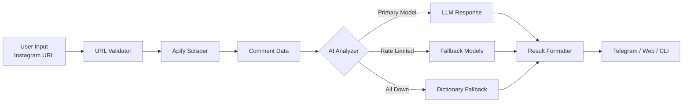

<div align="center">

# 📊 Comment Senti Bot

**AI-Powered Instagram Comment Sentiment Analyzer**

Analyze Instagram post comments using AI to uncover audience sentiment, categorize feedback, and generate actionable insights — all through a Telegram Bot, Web Dashboard, or CLI.

[](https://python.org)
[](https://aiogram.dev)
[](https://fastapi.tiangolo.com)
[](LICENSE)

</div>

---

## 🚀 Overview

**Comment Senti Bot** is a multi-interface application that scrapes comments from any public Instagram post and analyzes them using Large Language Models (LLMs) via OpenRouter API. It categorizes each comment as **Positive**, **Negative**, or **Neutral**, calculates sentiment percentages, and generates a concise AI-powered summary.

### Why Comment Senti Bot?

- 🔓 **No Instagram Login Required** — Uses [Apify](https://apify.com) cloud scraping infrastructure, eliminating the risk of account bans.
- 🤖 **Multi-Model AI Fallback** — Automatically rotates through 6+ free LLM models if the primary one is rate-limited.
- 📱 **Three Interfaces** — Telegram Bot, Web Dashboard (FastAPI), and CLI — use whichever suits your workflow.
- 🛡️ **Resilient by Design** — Built-in dictionary-based fallback analysis ensures results even when all AI models are unavailable.
- ⚡ **Non-Blocking Architecture** — Async I/O ensures the bot stays responsive to all users, even during long-running analyses.

---

## ✨ Key Features

| Feature | Description |
|---|---|
| **🔍 Comment Scraping** | Scrapes up to 50+ comments from any public Instagram post, reel, or IGTV |
| **🧠 AI Sentiment Analysis** | Categorizes comments into Positive, Negative, and Neutral with percentage breakdown |
| **📝 AI Summary** | Generates a concise summary of the overall audience mood in Uzbek |
| **🤖 Telegram Bot** | Interactive inline keyboard interface with category drill-down |
| **🌐 Web Dashboard** | Clean FastAPI-powered web UI with form submission and result pages |
| **💻 CLI Mode** | Terminal interface with rich-formatted tables and progress bars |
| **🔄 Multi-Model Fallback** | Chains through free LLMs (Gemma, Llama, Qwen, Nemotron, GPT-OSS) on rate-limit |
| **📖 Dictionary Fallback** | Keyword-based analysis as a last resort when all APIs are down |
| **🧹 Memory Management** | Built-in LRU-style cache eviction prevents memory leaks on long-running servers |
| **🔒 Secure Config** | All secrets managed via `.env` — nothing hardcoded |

---

## 🏗️ Architecture

```
comment-senti-bot/
│
├── main.py              # CLI entry point
├── run_bot.py           # Telegram Bot launcher
├── run_web.py           # Web Server launcher
├── config.py            # Configuration loader & validator
│
├── core/                # Core Engine (shared logic)
│   ├── scraper.py       # Apify-based Instagram comment scraper
│   ├── analyzer.py      # AI-powered sentiment analyzer (OpenRouter)
│   └── reporter.py      # Multi-format result formatter (Telegram/Web/CLI)
│
├── bot/                 # Telegram Bot Interface
│   ├── handlers.py      # Command & callback handlers
│   └── keyboards.py     # Inline keyboard layouts
│
├── web/                 # Web Interface
│   ├── app.py           # FastAPI application factory
│   ├── routes.py        # API endpoints & page routes
│   ├── templates/       # Jinja2 HTML templates
│   └── static/          # CSS & JS assets
│
├── .env.example         # Environment variables template
├── .gitignore           # Git exclusions
└── requirements.txt     # Python dependencies
```

### Data Flow



---

## 📦 Installation

### Prerequisites

- **Python 3.10+**
- **Apify Account** — [Sign up](https://apify.com) (free tier available)
- **OpenRouter API Key** — [Get one](https://openrouter.ai) (free models available)
- **Telegram Bot Token** — Create via [@BotFather](https://t.me/BotFather)

### Setup

```bash
# 1. Clone the repository
git clone https://github.com/yourusername/comment-senti-bot.git
cd comment-senti-bot

# 2. Create and activate virtual environment
python -m venv venv
source venv/bin/activate        # Linux/macOS
venv\Scripts\activate           # Windows

# 3. Install dependencies
pip install -r requirements.txt

# 4. Configure environment variables
cp .env.example .env
# Edit .env and fill in your API keys
```

### Environment Variables

| Variable | Required | Description |
|---|---|---|
| `APIFY_API_TOKEN` | ✅ | API token from [apify.com](https://apify.com) |
| `OPENROUTER_API_KEY` | ✅ | API key from [openrouter.ai](https://openrouter.ai) |
| `TELEGRAM_BOT_TOKEN` | ✅ | Bot token from [@BotFather](https://t.me/BotFather) |
| `MAX_COMMENTS` | ❌ | Maximum comments to scrape (default: `50`) |
| `OPENROUTER_MODEL` | ❌ | Primary LLM model (default: `google/gemma-4-31b-it:free`) |

---

## 🎮 Usage

### 🤖 Telegram Bot

```bash
python run_bot.py
```

Then open your bot in Telegram and:
1. Send `/start` to see the welcome message
2. Send any Instagram post URL directly, or use:
   ```
   /analyze https://www.instagram.com/p/ABC123/
   ```
3. Wait 30–60 seconds for the AI to analyze
4. Browse results with interactive inline buttons:
   - **📂 Category Details** — drill down into Positive/Negative/Neutral
   - **🔄 New Analysis** — analyze another post
   - **❓ Help** — usage guide

### 🌐 Web Dashboard

```bash
python run_web.py
```

Open [http://localhost:8000](http://localhost:8000) in your browser:
1. Paste an Instagram post URL
2. Click "Analyze"
3. View sentiment breakdown and categorized comments

### 💻 CLI Mode

```bash
python main.py https://www.instagram.com/p/ABC123/
```

Displays a rich-formatted terminal output with progress bars and colored tables.

---

## 🧠 How the AI Analysis Works

1. **Scraping** — Apify's cloud infrastructure fetches comments without login credentials
2. **Prompt Engineering** — Comments are formatted and sent to an LLM with a structured system prompt requesting JSON output
3. **Multi-Model Rotation** — If the primary model returns a 429 (rate limit), the system automatically tries:
   - `google/gemma-4-31b-it:free`
   - `meta-llama/llama-3.3-70b-instruct:free`
   - `google/gemma-4-26b-a4b-it:free`
   - `qwen/qwen3-coder:free`
   - `nvidia/nemotron-3-nano-omni-30b-a3b-reasoning:free`
   - `openai/gpt-oss-120b:free`
4. **JSON Extraction** — Robust parser handles raw JSON, Markdown-wrapped JSON, and brace-matching fallback
5. **Dictionary Fallback** — If all models fail, a keyword-based analyzer using Uzbek positive/negative word lists provides basic results

---

## 🛠️ Tech Stack

| Technology | Purpose |
|---|---|
| [Python 3.10+](https://python.org) | Core language |
| [Apify Client](https://docs.apify.com/api/client/python) | Instagram comment scraping (no login) |
| [OpenAI SDK](https://github.com/openai/openai-python) | LLM communication via OpenRouter |
| [Aiogram 3](https://aiogram.dev) | Async Telegram Bot framework |
| [FastAPI](https://fastapi.tiangolo.com) | Web application framework |
| [Uvicorn](https://www.uvicorn.org) | ASGI web server |
| [Jinja2](https://jinja.palletsprojects.com) | HTML template engine |
| [Rich](https://rich.readthedocs.io) | Beautiful terminal output |
| [python-dotenv](https://pypi.org/project/python-dotenv/) | Environment variable management |

---

## 📋 Supported URL Formats

The bot accepts the following Instagram URL formats:

```
https://www.instagram.com/p/ABC123/
https://www.instagram.com/reel/ABC123/
https://www.instagram.com/tv/ABC123/
https://instagram.com/p/ABC123/
```

> ⚠️ **Note:** The post must be **public**. Private or deleted posts cannot be scraped.

---

## 🤝 Contributing

Contributions are welcome! Here's how:

1. Fork the repository
2. Create a feature branch (`git checkout -b feature/amazing-feature`)
3. Commit your changes (`git commit -m 'Add amazing feature'`)
4. Push to the branch (`git push origin feature/amazing-feature`)
5. Open a Pull Request

---

## 📄 License

This project is licensed under the **MIT License** — see the [LICENSE](LICENSE) file for details.

---

## 👤 Author

**Azizbek Saidmurodov**

---

<div align="center">

Made with ❤️ using Python, AI, and Open Source

</div>